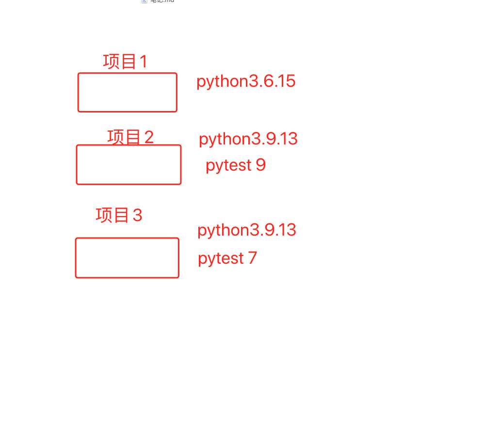

### 项目搭建

config:   存放配置文件

```
1、 ini文件  配置多样化少一点，假如一个环境有多数据库 读配置不具有通用性，也不好维护
2、 json文件
3、 py文件  不能用代码文件，原因：假设你要新起一个流水线，你的配置没得集中化管理，运维怎么样给你处理？ 相比较其他方式的配置文件 ，py文件不具有配置文件通用性
4、 yaml文件  数据结构可进行嵌套，可转成代码里面的一个数组里有多个字典元素，可以更加方便实现一个环境多数据配置
```

```inicsharp
; 通用配置,文件后缀.ini
[common]

application.directory = APPLICATION_PATH  "/application"
application.dispatcher.catchException = TRUE


; 数据库配置
resources.database.master.driver = "pdo_mysql"
resources.database.master.hostname = "127.0.0.1"
resources.database.master.port = 3306
resources.database.master.database = "database"
resources.database.master.username = "username"
resources.database.master.password = "password"
resources.database.master.charset = "UTF8"


; 生产环境配置
[product : common]

; 开发环境配置
[develop : common]

resources.database.slave.driver = "pdo_mysql"
resources.database.slave.hostname = "127.0.0.1"
resources.database.slave.port = 3306
resources.database.slave.database = "test"
resources.database.slave.username = "root"
resources.database.slave.password = "123456"
resources.database.slave.charset = "UTF8"

; 测试环境配置
[test : common]
```


### 项目设计

1、config

2、数据驱动设计

- 请求模块的二次封装  --> 要求数据和代码完全隔离 --> httprunner
- 上下接口的关系处理封装
- 断言封装


3、测试网站

https://httpbin.org/#/HTTP_Methods


4、面试问题

- 数据怎么样存储
  - **excel** ： 
    - 相比json和yaml，存储的字符串不是在代码世界里面通用的标准格式，不能进行反序列化操作，大量数据维护成本也相对较高，如果后续测试数据要落入测试库，工作量也会比json和yaml的多
  - **json**：
    - 相比yaml ，如果数据描述上，存在多个对象嵌套，没有yaml那么清晰
  - **yaml**：
    - 通用数据文本格式，可通过反序列化转成代码对象
    - 数据展示上更加清晰客观，相比json更容易维护，用格式和符合代替了 花括号和括号
  - Sql：
    - 如果没有界面的测试平台，那么数据维护的成本和写用例的成本是很高的

yaml2json: https://oktools.net/json2yaml